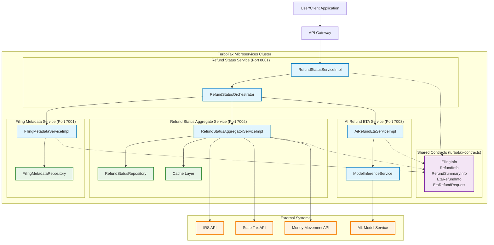

# TurboTax Microservices Architecture

## Overview
This diagram shows the TurboTax microservices architecture with 4 core services, shared contracts, and external integrations.

## Service Details

### 1. **Refund Status Service** (Port 8001)
- **Main Entry Point**: Primary API for refund status queries
- **Endpoints**: 
  - `GET /refund-status` - Get latest refund status summary
- **Role**: Orchestrates calls to other microservices
- **Dependencies**: Filing Metadata, Refund Aggregate, AI ETA services

### 2. **Filing Metadata Service** (Port 7001)  
- **Purpose**: Manages tax filing information and metadata
- **Endpoints**:
  - `GET /filing-status/{userId}` - Get latest filing for user
- **Data Access**: FilingMetadataRepository
- **Returns**: FilingInfo objects

### 3. **Refund Status Aggregate Service** (Port 7002)
- **Purpose**: Aggregates refund status from multiple external sources
- **Endpoints**:
  - `GET /aggregate-status/{filingId}` - Get refund statuses for filing
- **External Integrations**: IRS, State Tax APIs, Money Movement
- **Features**: Caching layer for performance
- **Returns**: RefundInfo objects

### 4. **AI Refund ETA Service** (Port 7003)
- **Purpose**: Provides AI-powered ETA predictions for refunds
- **Endpoints**:
  - `GET /refund-eta` - Predict refund ETA
- **ML Integration**: ModelInferenceService for predictions
- **Input**: EtaRefundRequest with filing/refund context
- **Returns**: EtaRefundInfo with predicted dates

## Data Flow

1. **User Request**: Client requests refund status
2. **Orchestration**: Refund Status Service coordinates the workflow
3. **Filing Lookup**: Gets user's latest filing information
4. **Status Aggregation**: Fetches refund status from external systems
5. **ETA Prediction**: AI service predicts delivery timeframes
6. **Response Assembly**: Orchestrator combines all data into RefundSummaryInfo

## Shared Contracts

All services use shared contract classes from `turbotax-contracts`:

- **FilingInfo**: Tax filing metadata
- **RefundInfo**: Refund status information  
- **RefundSummaryInfo**: Combined refund status with ETA
- **EtaRefundInfo**: AI-predicted refund ETA details
- **EtaRefundRequest**: Request for ETA prediction

## Technology Stack

- **Framework**: Spring Boot 3.5.0 + WebFlux (Reactive)
- **Java Version**: 24
- **Build System**: Gradle (Multi-module)
- **Architecture Pattern**: Microservices with API Gateway
- **Communication**: REST APIs with JSON
- **Monitoring**: Actuator health endpoints
- **Logging**: Structured logging to `logs/` directory

## Deployment & Operations

- **Health Checks**: `/actuator/health` on all services
- **Logging**: Centralized in `logs/` directory
- **Build**: `./gradlew startAllServices` for development
- **Monitoring**: Service health dashboard via Gradle tasks

## Key Architectural Patterns

1. **Service Orchestration**: Central orchestrator coordinates workflow
2. **API Gateway Pattern**: Single entry point for clients  
3. **Shared Data Contracts**: Common domain models across services
4. **External Service Integration**: Proxy pattern for external APIs
5. **Caching Strategy**: Performance optimization in aggregate service
6. **ML/AI Integration**: Dedicated service for predictive analytics