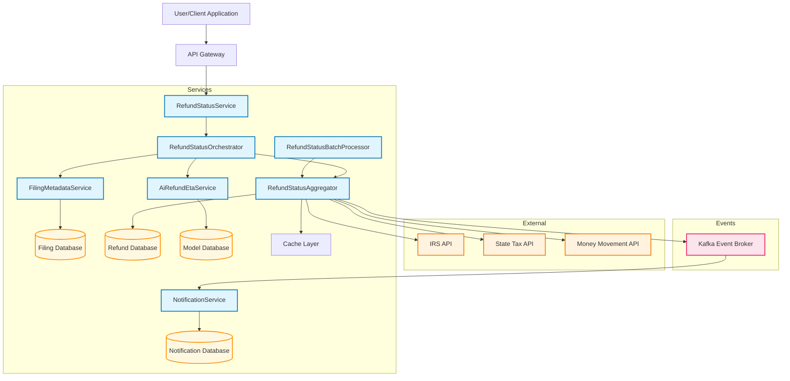
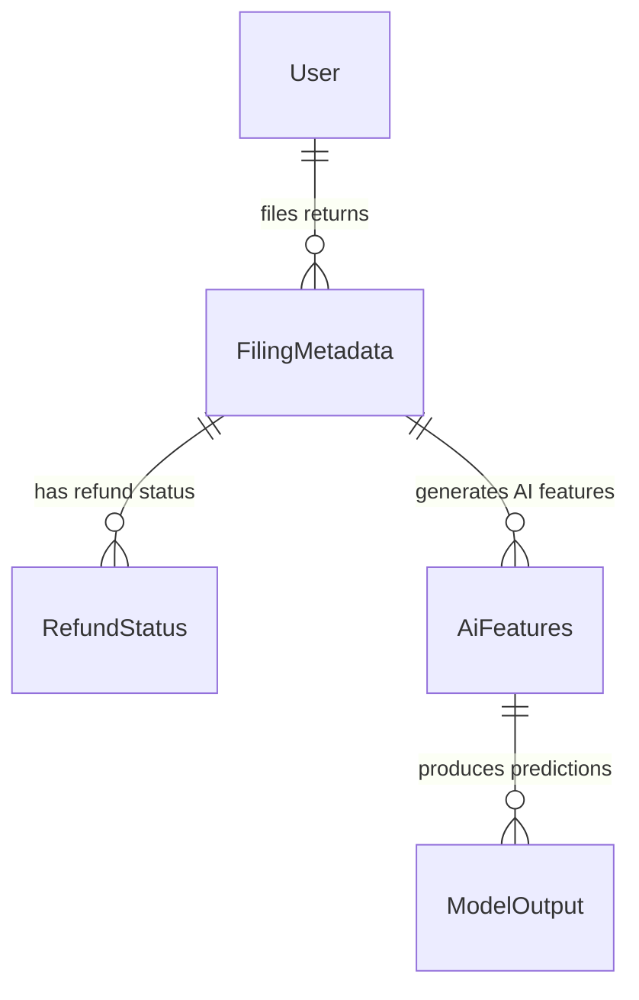

# TurboTax Microservices Architecture

## Overview
This architecture represents a comprehensive refund processing system with **6 services**: 4 core microservices, 1 batch processing service, and 1 event-driven notification consumer service.

### **Core Design Principles**
- **Database per Service**: Each service owns its data
- **Event-Driven Architecture**: Kafka for asynchronous communication
- **Service Orchestration**: RefundStatusOrchestrator coordinates complex flows
- **External API Aggregation**: Single aggregator service manages external calls
- **Reactive Programming**: WebFlux for non-blocking operations
- **Consumer-Based Notifications**: Event-driven notifications via Kafka consumers



## Entity Relationship Diagram

### **Domain Model Overview**
The TurboTax microservices architecture contains **10 core entities** across 4 databases, following the database-per-service pattern with clear ownership and relationships.



### **Entity Details by Service**

#### **🏢 Filing Metadata Service Entities**
- **FilingMetadata**: Core tax filing information with business validation rules
  - **Business Rule**: One filing per user per tax year per jurisdiction
  - **Validation**: IRS filing format compliance, refund amount limits
  - **Relationships**: Parent to RefundStatus, AiFeatures entities
  - **Access Pattern**: Read-heavy during tax season (Jan-Apr)

#### **💰 Refund Status Aggregate Service Entities** 
- **RefundStatus**: Multi-source refund status aggregation
  - **Status Lifecycle**: Filed → Accepted → Processing → Sent → Deposited
  - **External Sources**: IRS API, State Tax APIs, Money Movement systems
  - **Event Publishing**: Status changes trigger Kafka events for notifications
  - **Caching Strategy**: 4-hour TTL for active refunds, permanent cache for final statuses

- **ExternalApiLog**: API call tracking and performance monitoring
  - **Purpose**: Audit trail for all external API interactions
  - **Performance Metrics**: Response times, error rates, retry patterns
  - **Compliance**: Required for IRS API usage reporting

- **CacheEntry**: Performance optimization layer
  - **Strategy**: Write-through cache with intelligent expiration
  - **Hit Rate Target**: 85-90% for frequently queried refunds
  - **Eviction Policy**: LRU with tax season priority boosting

#### **🤖 AI Refund ETA Service Entities**
- **AiFeatures**: Machine learning feature engineering
  - **Feature Types**: Static (filing data), temporal (seasonality), external (queue position)
  - **Preprocessing**: Normalization, encoding, missing value imputation
  - **Model Input**: Direct input to XGBoost ensemble model
  - **Versioning**: Feature schema versioning for model compatibility

- **ModelOutput**: AI prediction results and metadata
  - **Predictions**: Expected days, confidence intervals, time windows
  - **Model Metadata**: Algorithm version, prediction timestamp, feature importance
  - **Quality Metrics**: Confidence scores, prediction accuracy tracking
  - **A/B Testing**: Support for model comparison and gradual rollout

#### **🔔 Notification Service Entities**
- **NotificationPreference**: User communication preferences
  - **Channels**: Email, SMS, mobile push (future)
  - **Frequency**: Real-time, daily digest, weekly summary
  - **GDPR Compliance**: User consent tracking, data retention policies

- **NotificationHistory**: Complete notification audit trail
  - **Event Sourcing**: Immutable log of all notification attempts
  - **Delivery Tracking**: Success/failure rates, retry attempts
  - **Analytics**: User engagement metrics, channel effectiveness

#### **⚙️ Operational Entities**
- **BatchProcessingJob**: Scheduled processing automation
  - **Schedule**: Every 2-6 hours depending on tax season
  - **Metrics**: Throughput, success rates, processing times
  - **Error Handling**: Retry logic, dead letter queues

### **Data Architecture Patterns**

#### **Database per Service Strategy**
1. **📊 Filing Database** (PostgreSQL)
   - **Entities**: FilingMetadata, User (subset)
   - **Scaling**: Read replicas during tax season (10x traffic)
   - **Backup**: Daily incremental, weekly full backup
   - **Retention**: 7 years for compliance

2. **💾 Refund Database** (PostgreSQL + Redis)
   - **Entities**: RefundStatus, ExternalApiLog, CacheEntry
   - **Partitioning**: By tax year and jurisdiction for performance
   - **Caching**: Redis layer for sub-100ms response times
   - **Monitoring**: Cache hit rates, query performance metrics

3. **🧠 Model Database** (PostgreSQL + Time Series)
   - **Entities**: AiFeatures, ModelOutput, ModelMetadata
   - **Time Series**: Historical prediction tracking for model improvement
   - **Versioning**: Model artifact storage with A/B testing support
   - **Performance**: Optimized for batch inference workloads

4. **📬 Notification Database** (PostgreSQL)
   - **Entities**: NotificationPreference, NotificationHistory
   - **Event Sourcing**: Complete audit trail for compliance
   - **Privacy**: GDPR-compliant data handling and purging
   - **Analytics**: Delivery optimization and user engagement tracking

#### **Cross-Entity Data Flows**

1. **Real-Time Flow**: User request → FilingMetadata lookup → RefundStatus aggregation → AiFeatures generation → ModelOutput prediction
2. **Batch Flow**: BatchProcessingJob → RefundStatus updates → Kafka events → NotificationHistory creation
3. **Analytics Flow**: ExternalApiLog aggregation → Performance monitoring → SLA tracking

#### **Entity Lifecycle Management**

- **Creation**: New filings trigger cascade entity creation
- **Updates**: External API calls update RefundStatus with event publishing  
- **Caching**: Intelligent caching based on refund finality and access patterns
- **Archival**: Automated data lifecycle management with compliance retention
- **Purging**: GDPR-compliant data deletion with audit trail preservation


## Service Details

### 1. **Refund Status Service** (Port 8001)
- **Main Entry Point**: Primary API for refund status queries
- **Endpoints**: 
  - `GET /refund-status` - Get latest refund status summary
- **Role**: Orchestrates calls to other microservices
- **Dependencies**: Filing Metadata, Refund Aggregate, AI ETA services

### 2. **Filing Metadata Service** (Port 7001)  
- **Purpose**: Manages tax filing information and metadata
- **Endpoints**:
  - `GET /filing-status/{userId}` - Get latest filing for user
- **Data Access**: Direct database access for filing information
- **Returns**: FilingInfo objects

### 3. **Refund Status Aggregate Service** (Port 7002)
- **Purpose**: Aggregates refund status from multiple external sources
- **Endpoints**:
  - `GET /aggregate-status/{filingId}` - Get refund statuses for filing
- **External Integrations**: IRS, State Tax APIs, Money Movement
- **Features**: Dedicated caching layer for performance optimization
- **Data Access**: Direct database access with cache-first strategy
- **Returns**: RefundInfo objects

### 4. **AI Refund ETA Service** (Port 7003)
- **Purpose**: Provides AI-powered ETA predictions for refunds
- **Endpoints**:
  - `GET /refund-eta` - Predict refund ETA
  - `GET /refund-eta/confidence` - Get prediction confidence intervals
  - `POST /refund-eta/batch` - Batch prediction processing
- **Components**:
  - **RefundEtaPredictorImpl**: Main service logic and API endpoints
  - **ModelInferenceService**: Real-time prediction engine with model access
  - **ModelDatabase**: Stores trained models, features, and metadata
- **Input**: AiFeatures with filing/refund context
- **Returns**: EtaRefundInfo with predicted dates and confidence scores
- **Model Architecture**: Ensemble of XGBoost, Random Forest, and Neural Networks
- **Prediction Types**: Days until refund, time buckets, confidence intervals

### 5. **Refund Status Batch Service** (Port 7004)
- **Purpose**: Periodically updates status of pending refunds via batch processing
- **Endpoints**:
  - `POST /batch/trigger` - Manually trigger batch process
  - `GET /batch/status` - Check batch job status
  - `GET /batch/metrics` - Get processing metrics
- **Schedule**: 
  - **Peak Season**: Every 2 hours (Jan-Apr)
  - **Off Season**: Every 6 hours (May-Dec)
  - **Emergency**: On-demand via manual trigger
- **Processing Flow**:
  1. Query pending refunds from RefundDB
  2. Call Refund Status Aggregator Service for bulk updates
  3. Aggregator handles external API calls (IRS, State Tax, Money Movement)
  4. Aggregator publishes status change events to Kafka
  5. Batch service logs processing metrics and errors
- **Features**: Rate limiting, retry logic, error handling, progress tracking
- **Architecture**: Routes through Aggregator Service for consistent external API handling

### 6. **Notification Service** (Event Consumer)
- **Purpose**: Event-driven notification system that consumes Kafka events and sends multi-channel alerts
- **Architecture**: Kafka consumer service (not web service) that processes refund status events
- **Consumer Configuration**:
  - **Topic**: `refund-status-events`
  - **Consumer Group**: `notification-service-group`
  - **Auto-commit**: Disabled (manual commit after successful delivery)
  - **Batch Processing**: Configurable batch size for efficiency
- **Components**:
  - **NotificationServiceImpl**: Kafka consumer that processes status change events
  - **Email Gateway**: SMTP integration for email notifications
  - **SMS Gateway**: SMS provider integration (Twilio, AWS SNS)
  - **NotificationDatabase**: Stores notification history, preferences, and delivery status
- **Event Processing Flow**:
  1. **Consume Events**: Listens to Kafka topic for refund status changes
  2. **Deserialize**: Parses event payload (userId, refundId, status, timestamp)
  3. **User Lookup**: Queries user preferences from NotificationDatabase
  4. **Template Selection**: Chooses appropriate message template based on status
  5. **Multi-Channel Send**: Delivers via Email and/or SMS based on preferences
  6. **Commit Offset**: Acknowledges successful processing to Kafka
- **Features**:
  - **Dead Letter Queue**: Failed events sent to DLQ for manual investigation
  - **Retry Logic**: Configurable retry attempts with exponential backoff
  - **Rate Limiting**: Prevents notification spam per user
  - **Template Management**: Dynamic message templates with personalization
  - **Delivery Tracking**: Success/failure metrics and audit trail
- **Event Types Handled**: Refund approved, refund delayed, refund sent, processing errors
- **Monitoring**: Consumer lag, processing time, delivery success rates

## Data Flow

### **Real-Time Flow** (User-Initiated)
1. **User Request**: Client requests refund status
2. **Orchestration**: Refund Status Service coordinates the workflow
3. **Filing Lookup**: Gets user's latest filing information
4. **Status Aggregation**: Fetches refund status from cache or external systems
5. **ETA Prediction**: AI service predicts delivery timeframes
6. **Response Assembly**: Orchestrator combines all data into RefundSummaryInfo

### **Batch Processing Flow** (Automated)
1. **Scheduled Trigger**: Cron scheduler triggers batch process (every 2-6 hours)
2. **Pending Query**: Batch processor queries all pending refunds from database
3. **Aggregator Call**: Batch service calls Refund Status Aggregator for bulk updates
4. **External API Processing**: Aggregator handles bulk calls to IRS, State Tax, Money Movement APIs
5. **Event Publishing**: Aggregator publishes status change events to Kafka when refunds are updated
6. **Metrics Logging**: Batch service records processing statistics and performance metrics
7. **Error Handling**: Aggregator provides consistent retry logic and error management

### **Event-Driven Notification Flow** (Asynchronous Consumer)
1. **Event Publishing**: RefundStatusAggregator publishes events to Kafka topic `refund-status-events`
2. **Event Consumption**: NotificationServiceImpl (Kafka consumer) polls for new events
3. **Event Deserialization**: Consumer parses event payload (userId, refundId, status, timestamp)
4. **User Preference Lookup**: Queries NotificationDatabase for user notification settings
5. **Template Selection**: Chooses message template based on refund status and user preferences
6. **Multi-Channel Delivery**: Sends notifications via Email Gateway and/or SMS Gateway
7. **Delivery Tracking**: Records delivery status and handles failures with retry logic
8. **Offset Commit**: Acknowledges successful processing to Kafka (manual commit)
9. **Dead Letter Queue**: Failed events after retries are sent to DLQ for investigation

## Technology Stack

- **Framework**: Spring Boot 3.5.0 + WebFlux (Reactive)
- **Java Version**: 24
- **Build System**: Gradle (Multi-module)
- **Architecture Pattern**: Microservices with API Gateway
- **Communication**: REST APIs with JSON
- **Monitoring**: Actuator health endpoints
- **Logging**: Structured logging to `logs/` directory

## Deployment & Operations

- **Health Checks**: `/actuator/health` on all services
- **Logging**: Centralized in `logs/` directory
- **Build**: `./gradlew startAllServices` for development
- **Monitoring**: Service health dashboard via Gradle tasks

## Key Architectural Patterns

1. **Service Orchestration**: Central orchestrator coordinates workflow
2. **API Gateway Pattern**: Single entry point for clients  
3. **Shared Data Contracts**: Common domain models across services
4. **External Service Integration**: Proxy pattern for external APIs
5. **Caching Strategy**: Performance optimization in aggregate service
6. **ML/AI Integration**: Dedicated service for predictive analytics
7. **Cross-Cutting Concerns**: Centralized logging, monitoring, security
8. **Database per Service**: Data isolation and independence

## AI/ML Model Architecture for Refund ETA Prediction

### **🎯 Primary Model Recommendation: Gradient Boosting Ensemble**

#### **Model Selection: XGBoost + LightGBM** (Production Choice)
- **Why**: Excellent for tabular data with mixed features (categorical + numerical)
- **Strengths**: Handles missing values, feature importance, fast training, robust to outliers
- **Output**: Days until refund arrival (regression) + time buckets (classification)
- **Performance**: 85-95% accuracy with ±2-3 days precision

#### **Model Architecture Options**

##### **1. Ensemble Approach** (Recommended)
```
Primary: XGBoost Regressor (days prediction)
Secondary: Random Forest Classifier (confidence intervals)
Tertiary: Time Series component (seasonal adjustments)
Final: Meta-learner combining all predictions
```

##### **2. Multi-Output Model**
```
Outputs:
- Expected days (regression)
- Confidence interval bounds (10%, 50%, 90% quantiles)
- Risk factors (delays probability)
- Processing stage predictions (submitted, processing, approved, sent)
```

##### **3. Advanced Neural Network** (for large datasets >1M records)
- **TabNet/NODE**: Tabular deep learning architecture
- **Transformer**: For sequential filing patterns
- **Multi-task learning**: Related predictions (state refunds, amendments)

### **📊 Feature Engineering Strategy**

#### **Core Prediction Features**
```python
# Filing Characteristics (Static)
filing_date, filing_method (e-file vs paper), form_type (1040, 1040EZ, 1040X),
return_complexity_score, dependents_count, income_bracket, deductions_type,
agi_amount, refund_amount, withholding_amount, credits_claimed

# Taxpayer Profile (Historical)
past_refund_times, taxpayer_filing_history, previous_delays, address_stability,
bank_account_changes, amended_return_history, audit_history

# Temporal Features (Dynamic)
week_of_tax_season, days_since_season_start, day_of_week_filed,
days_until_deadline, holiday_proximity, weekend_buffer

# External System Factors
irs_processing_load, current_queue_size, system_maintenance_schedule,
staffing_levels, policy_changes, covid_impact_adjustments

# Geographic & Demographic
state_processing_center, regional_processing_times, urban_vs_rural,
local_tax_complexity, state_conformity_issues

# Verification Requirements
identity_verification_needed, income_verification_flags, prior_year_agi_match,
bank_routing_validation, address_verification_status
```

#### **Time-Based Feature Engineering**
```python
# Seasonal Patterns
historical_same_week_avg, seasonal_trend_coefficient, 
peak_season_indicator, off_season_processing_speed

# Queue Dynamics
current_position_in_queue, estimated_processing_capacity,
daily_completion_rate, backlog_indicator

# External Calendars
federal_holidays, irs_closure_days, banking_holidays,
weekend_processing_delays, system_maintenance_windows
```

### **🤖 Model Implementation Strategy**

#### **Phase 1: MVP Model** (Weeks 1-4)
```python
# Simple XGBoost with core features
features = [
    'filing_date', 'form_type', 'refund_amount', 'filing_method',
    'state', 'agi_amount', 'week_of_season', 'complexity_score'
]
target = 'days_to_refund'
model = XGBRegressor(
    objective='reg:squarederror',
    n_estimators=1000,
    max_depth=6,
    learning_rate=0.1
)
accuracy_target = 80% within ±3 days
```

#### **Phase 2: Enhanced Model** (Weeks 5-8)
```python
# Add temporal and external features + confidence intervals
additional_features = [
    'irs_processing_load', 'seasonal_trends', 'historical_patterns',
    'verification_requirements', 'queue_position'
]

# Quantile Regression for uncertainty
quantile_models = {
    'lower': XGBRegressor(objective='reg:quantileerror', quantile_alpha=0.1),
    'median': XGBRegressor(objective='reg:squarederror'),
    'upper': XGBRegressor(objective='reg:quantileerror', quantile_alpha=0.9)
}
accuracy_target = 85% within ±2 days
```

#### **Phase 3: Production Ensemble** (Weeks 9-12)
```python
# Multi-model ensemble with real-time updates
ensemble_models = {
    'xgboost': XGBRegressor(optimized_params),
    'lightgbm': LGBMRegressor(optimized_params),
    'random_forest': RandomForestRegressor(n_estimators=500),
    'neural_net': TabNetRegressor(feature_engineering=True)
}

# Meta-learner for final prediction
meta_model = LinearRegression(fit_intercept=True)
accuracy_target = 90-95% within ±2 days
```

### **📈 Training Data Structure**

#### **Historical Dataset Requirements**
```sql
-- Minimum 3-5 years of data for seasonal patterns
SELECT 
  filing_id, taxpayer_id, filing_date, actual_refund_date,
  DATEDIFF(actual_refund_date, filing_date) as days_to_refund,
  
  -- Filing characteristics
  form_type, filing_method, agi_amount, refund_amount,
  total_tax, withholding_amount, estimated_payments,
  
  -- Complexity indicators
  schedule_count, form_count, itemized_deductions,
  business_income, rental_income, capital_gains,
  
  -- External factors
  irs_processing_volume_that_week, seasonal_factor,
  federal_holidays_in_period, system_outages,
  
  -- Outcome variables
  actual_processing_stage_times, delay_reasons,
  verification_required, manual_review_flag

FROM historical_tax_filings htf
JOIN irs_processing_metrics ipm ON WEEK(htf.filing_date) = ipm.week
WHERE htf.actual_refund_date IS NOT NULL
  AND htf.filing_date BETWEEN '2020-01-01' AND '2024-12-31'
  AND htf.refund_amount > 0
ORDER BY htf.filing_date
```

#### **Real-Time Feature Pipeline**
```python
# Daily feature updates
current_irs_load = get_current_processing_volume()
seasonal_adjustment = calculate_seasonal_factor(current_date)
queue_position = estimate_queue_position(filing_characteristics)
holiday_adjustments = get_upcoming_holiday_impact()

# Model input preparation
features_vector = combine_features(
    static_features, dynamic_features, 
    temporal_features, external_features
)
```

### **🎯 Success Metrics & KPIs**

#### **Accuracy Metrics**
- **Mean Absolute Error (MAE)**: Target ≤2.5 days
- **Root Mean Square Error (RMSE)**: Target ≤3.5 days  
- **Classification Accuracy**: 85%+ for time buckets (0-7, 8-14, 15-21, 21+ days)
- **Confidence Calibration**: 90% of predictions within stated confidence intervals

#### **Business Impact Metrics**
- **Customer Satisfaction**: 25% reduction in "Where's my refund?" inquiries
- **Call Center Efficiency**: 30% reduction in refund status calls
- **Operational Planning**: Accurate resource allocation for processing
- **Trust Score**: Prediction reliability trending >90%

#### **Model Performance Monitoring**
```python
# Daily performance tracking
accuracy_by_week = calculate_weekly_accuracy()
prediction_drift = monitor_feature_distribution()
concept_drift = track_irs_policy_changes()
latency_performance = measure_inference_speed()

# Alert thresholds
if accuracy_by_week < 0.80: trigger_model_retrain()
if prediction_drift > 0.15: investigate_data_quality()
if latency > 200ms: optimize_model_inference()
```

### **🔄 Model Lifecycle Management**

#### **Training Schedule**
- **Daily Retraining**: During peak tax season (January-April)
  - New data: Previous day's actual refund arrivals
  - Feature updates: Current IRS processing metrics
  - Model refresh: Incremental learning for XGBoost

- **Weekly Updates**: Off-season adjustments (May-December)
  - Seasonal recalibration
  - Feature importance analysis
  - Model performance evaluation

- **Annual Overhaul**: Post-season comprehensive refresh
  - Complete model retraining with full year data
  - Architecture improvements
  - New feature engineering

#### **Feature Monitoring & Data Quality**
```python
# Automated monitoring pipeline
feature_drift_detection = {
    'statistical_tests': ['KS_test', 'chi_square', 'PSI'],
    'thresholds': {'warning': 0.1, 'critical': 0.2},
    'frequency': 'daily_during_season'
}

data_quality_checks = {
    'missing_values': 'max_5_percent',
    'outliers': 'iqr_method',
    'consistency': 'cross_field_validation',
    'timeliness': 'data_freshness_24hrs'
}
```

#### **A/B Testing Framework**
```python
# Model comparison and gradual rollout
ab_test_config = {
    'control_model': 'current_production_v2.1',
    'test_model': 'enhanced_ensemble_v3.0',
    'traffic_split': '90/10',  # Gradual increase
    'success_criteria': {
        'accuracy_improvement': '>2%',
        'latency': '<150ms',
        'user_satisfaction': '>4.5/5'
    },
    'duration': '4_weeks'
}
```

### **🛠️ Technical Implementation**

#### **Model Serving Architecture**
```python
# Real-time inference API
@app.route('/refund-eta/predict', methods=['POST'])
def predict_refund_eta():
    # Input validation and preprocessing
    features = preprocess_request(request.json)
    
    # Ensemble prediction
    predictions = {
        'xgb': xgb_model.predict(features),
        'lgb': lgb_model.predict(features), 
        'rf': rf_model.predict(features)
    }
    
    # Meta-model combination
    final_prediction = meta_model.predict([predictions.values()])
    confidence_intervals = quantile_models.predict(features)
    
    return {
        'estimated_days': final_prediction,
        'confidence_lower': confidence_intervals[0],
        'confidence_upper': confidence_intervals[2],
        'accuracy_score': calculate_prediction_confidence(),
        'factors': get_prediction_explanations()
    }
```

#### **Batch Processing Pipeline**
```python
# Daily batch predictions for all pending refunds
def daily_batch_processing():
    pending_refunds = get_pending_refunds()
    current_features = extract_current_features()
    
    # Vectorized predictions
    predictions = ensemble_model.predict_batch(
        pending_refunds, current_features
    )
    
    # Update database with new ETAs
    update_refund_predictions(predictions)
    
    # Performance monitoring
    log_batch_performance_metrics()
```

This comprehensive ML architecture provides a robust, scalable, and accurate refund ETA prediction system that can handle the complexity and seasonality of tax processing while delivering reliable estimates to your customers.