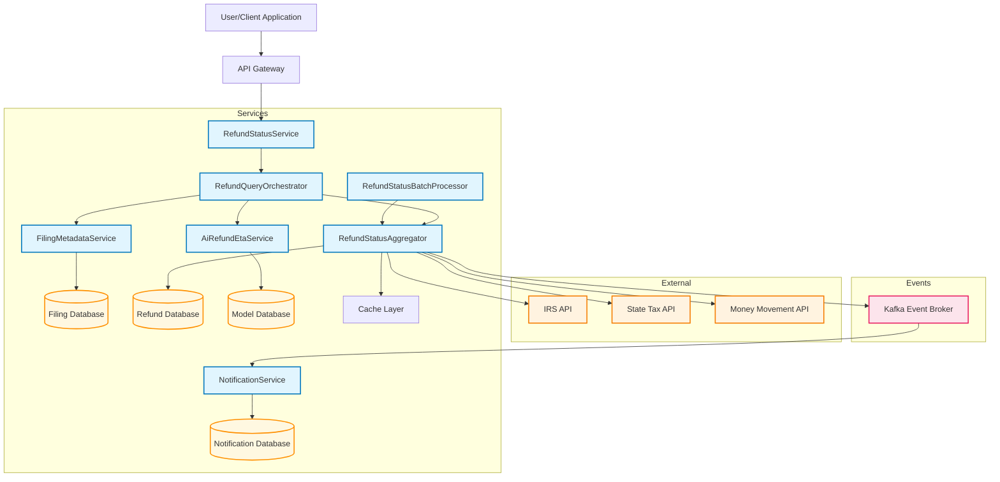
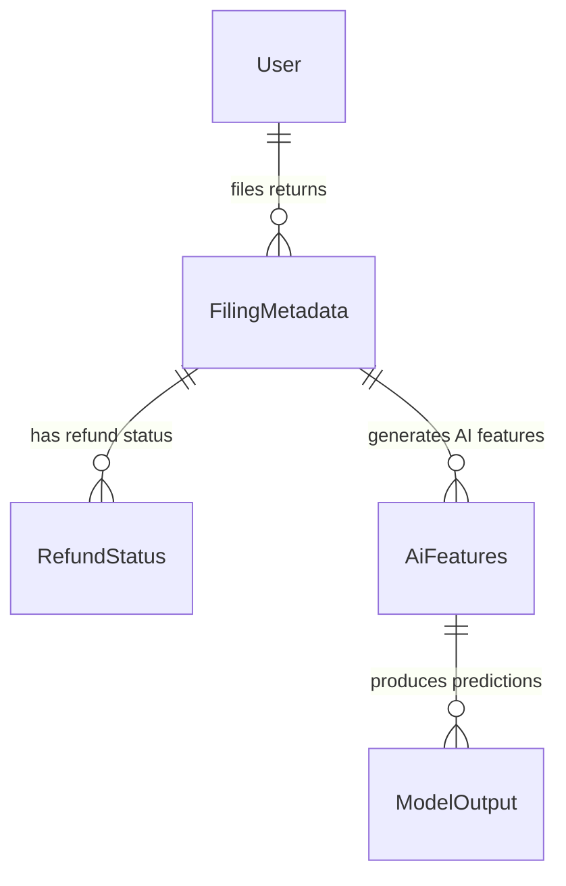

# TurboTax Microservices Architecture

## Overview
This architecture represents a comprehensive refund processing system with **6 services**: 4 core microservices, 1 batch processing service, and 1 event-driven notification consumer service.

### **Core Design Principles**
- **Database per Service**: Each service owns its data
- **Event-Driven Architecture**: Kafka for asynchronous communication
- **Service Orchestration**: RefundQueryOrchestrator coordinates complex flows
- **External API Aggregation**: Single aggregator service manages external calls
- **Reactive Programming**: WebFlux for non-blocking operations
- **Consumer-Based Notifications**: Event-driven notifications via Kafka consumers



## Entity Relationship Diagram

### **Domain Model Overview**
The TurboTax microservices architecture contains **10 core entities** across 4 databases, following the database-per-service pattern with clear ownership and relationships.



### **Entity Details by Service**

#### **🏢 Filing Metadata Service Entities**
- **FilingMetadata**: Core tax filing information with business validation rules
  - **Business Rule**: One filing per user per tax year per jurisdiction
  - **Validation**: IRS filing format compliance, refund amount limits
  - **Relationships**: Parent to RefundStatus, AiFeatures entities
  - **Access Pattern**: Read-heavy during tax season (Jan-Apr)

#### **💰 Refund Status Aggregate Service Entities** 
- **RefundStatus**: Multi-source refund status aggregation
  - **Status Lifecycle**: Filed → Accepted → Processing → Sent → Deposited
  - **External Sources**: IRS API, State Tax APIs, Money Movement systems
  - **Event Publishing**: Status changes trigger Kafka events for notifications
  - **Caching Strategy**: 4-hour TTL for active refunds, permanent cache for final statuses

- **ExternalApiLog**: API call tracking and performance monitoring
  - **Purpose**: Audit trail for all external API interactions
  - **Performance Metrics**: Response times, error rates, retry patterns
  - **Compliance**: Required for IRS API usage reporting

- **CacheEntry**: Performance optimization layer
  - **Strategy**: Write-through cache with intelligent expiration
  - **Hit Rate Target**: 85-90% for frequently queried refunds
  - **Eviction Policy**: LRU with tax season priority boosting

#### **🤖 AI Refund ETA Service Entities**
- **AiFeatures**: Machine learning feature engineering
  - **Feature Types**: Static (filing data), temporal (seasonality), external (queue position)
  - **Preprocessing**: Normalization, encoding, missing value imputation
  - **Model Input**: Direct input to XGBoost ensemble model
  - **Versioning**: Feature schema versioning for model compatibility

- **ModelOutput**: AI prediction results and metadata
  - **Predictions**: Expected days, confidence intervals, time windows
  - **Model Metadata**: Algorithm version, prediction timestamp, feature importance
  - **Quality Metrics**: Confidence scores, prediction accuracy tracking
  - **A/B Testing**: Support for model comparison and gradual rollout

#### **🔔 Notification Service Entities**
- **NotificationPreference**: User communication preferences
  - **Channels**: Email, SMS, mobile push (future)
  - **Frequency**: Real-time, daily digest, weekly summary
  - **GDPR Compliance**: User consent tracking, data retention policies

- **NotificationHistory**: Complete notification audit trail
  - **Event Sourcing**: Immutable log of all notification attempts
  - **Delivery Tracking**: Success/failure rates, retry attempts
  - **Analytics**: User engagement metrics, channel effectiveness

#### **⚙️ Operational Entities**
- **BatchProcessingJob**: Scheduled processing automation
  - **Schedule**: Every 2-6 hours depending on tax season
  - **Metrics**: Throughput, success rates, processing times
  - **Error Handling**: Retry logic, dead letter queues

### **Data Architecture Patterns**

#### **Database per Service Strategy**
1. **📊 Filing Database** (PostgreSQL)
   - **Entities**: FilingMetadata, User (subset)
   - **Scaling**: Read replicas during tax season (10x traffic)
   - **Backup**: Daily incremental, weekly full backup
   - **Retention**: 7 years for compliance

2. **💾 Refund Database** (PostgreSQL + Redis)
   - **Entities**: RefundStatus, ExternalApiLog, CacheEntry
   - **Partitioning**: By tax year and jurisdiction for performance
   - **Caching**: Redis layer for sub-100ms response times
   - **Monitoring**: Cache hit rates, query performance metrics

3. **🧠 Model Database** (PostgreSQL + Time Series)
   - **Entities**: AiFeatures, ModelOutput, ModelMetadata
   - **Time Series**: Historical prediction tracking for model improvement
   - **Versioning**: Model artifact storage with A/B testing support
   - **Performance**: Optimized for batch inference workloads

4. **📬 Notification Database** (PostgreSQL)
   - **Entities**: NotificationPreference, NotificationHistory
   - **Event Sourcing**: Complete audit trail for compliance
   - **Privacy**: GDPR-compliant data handling and purging
   - **Analytics**: Delivery optimization and user engagement tracking

#### **Cross-Entity Data Flows**

1. **Real-Time Flow**: User request → FilingMetadata lookup → RefundStatus aggregation → AiFeatures generation → ModelOutput prediction
2. **Batch Flow**: BatchProcessingJob → RefundStatus updates → Kafka events → NotificationHistory creation
3. **Analytics Flow**: ExternalApiLog aggregation → Performance monitoring → SLA tracking

#### **Entity Lifecycle Management**

- **Creation**: New filings trigger cascade entity creation
- **Updates**: External API calls update RefundStatus with event publishing  
- **Caching**: Intelligent caching based on refund finality and access patterns
- **Archival**: Automated data lifecycle management with compliance retention
- **Purging**: GDPR-compliant data deletion with audit trail preservation


## Service Details

### 1. **TurboTax Filing Query Service** (Port 7001)
- **Purpose**: Manages tax filing information and metadata queries
- **Technology**: Java/Spring Boot
- **Endpoints**:
  - `GET /filings` - Get user's filing history
  - `GET /filings/{filingId}` - Get specific filing details
- **Role**: Provides filing data access for other services
- **Data Access**: Direct database access for filing information

### 2. **TurboTax Refund Aggregation Service** (Port 7002)
- **Purpose**: Aggregates refund status from multiple external sources
- **Technology**: Java/Spring Boot
- **Endpoints**:
  - `GET /aggregate-status/filings/{filingId}` - Get refund statuses for filing
- **External Integrations**: IRS, State Tax APIs, Money Movement systems
- **Features**: Dedicated caching layer for performance optimization
- **Data Access**: Direct database access with cache-first strategy

### 3. **TurboTax Refund Query Service** (Port 8001)
- **Purpose**: Provides unified API for refund status queries
- **Technology**: Java/Spring Boot
- **Endpoints**:
  - `GET /refund-status` - Get latest refund status summary
- **Role**: Orchestrates calls to other microservices for refund information
- **Dependencies**: Filing Query Service, Refund Aggregation Service

### 4. **TurboTax Agent Service** (Port 8000)
- **Purpose**: Core AI service providing tax assistance via Ollama/OpenAI integration
- **Technology**: Python/FastAPI
- **Endpoints**:
  - `GET /health` - Service health check
  - `POST /query` - Direct AI assistance query
- **Components**:
  - **AI Provider Integration**: Dynamic provider selection (Ollama/OpenAI)
  - **Tax Knowledge Base**: Domain-specific tax assistance capabilities
  - **Query Processing**: Natural language processing for tax questions
- **Features**: Multi-provider AI support, tax-specific context awareness
- **Architecture**: Standalone Python service integrated into Gradle build system

### 5. **TurboTax Agent UI Service** (Port 8080)
- **Purpose**: Web interface for AI-powered tax assistance
- **Technology**: Python/FastAPI with web templates
- **Endpoints**:
  - `GET /api/health` - Service health check
  - `POST /api/assist` - AI assistance query via web interface
  - `GET /` - Web interface home page
- **Components**:
  - **Web Interface**: User-friendly chat interface for tax assistance
  - **API Integration**: Connects to Agent Service for AI processing
  - **Session Management**: User conversation context and history
- **Features**: Interactive web UI, conversation persistence, multi-provider support
- **Architecture**: Web service that proxies requests to core Agent Service

## Data Flow

### **Real-Time Refund Status Flow** (User-Initiated)
1. **User Request**: Client requests refund status via Refund Query Service
2. **Orchestration**: Refund Query Service coordinates the workflow
3. **Filing Lookup**: Calls Filing Query Service to get user's latest filing information
4. **Status Aggregation**: Calls Refund Aggregation Service to fetch refund status from external systems
5. **Response Assembly**: Refund Query Service combines all data into unified response

### **AI Assistance Flow** (User-Initiated)
1. **User Query**: User submits tax question via Agent UI Service web interface
2. **UI Processing**: Agent UI Service formats and validates the request
3. **AI Processing**: Agent UI Service forwards request to Agent Service for AI processing
4. **Provider Selection**: Agent Service selects appropriate AI provider (Ollama/OpenAI)
5. **Response Generation**: AI generates tax assistance response with domain knowledge
6. **Response Delivery**: Agent Service returns response to Agent UI Service for display

### **Batch Processing Flow** (Automated)
1. **Scheduled Trigger**: Automated processes trigger status updates
2. **Data Aggregation**: Refund Aggregation Service fetches updated status from external APIs
3. **Status Updates**: Service updates internal databases with latest refund information
4. **Event Publishing**: Status changes can trigger events for notification systems

### **Service Integration Flow**
- **Filing Query Service**: Provides filing data to Refund Query Service
- **Refund Aggregation Service**: Supplies aggregated status data to Refund Query Service
- **Agent Service**: Core AI processing backend for Agent UI Service
- **Agent UI Service**: Web interface that leverages Agent Service for AI capabilities

## Technology Stack

- **Java Services**: Spring Boot 3.5.0 + WebFlux (Reactive)
- **Python Services**: FastAPI with Uvicorn server
- **Java Version**: 24
- **Python Version**: 3.8+
- **Build System**: Gradle (Multi-module with Python integration)
- **Architecture Pattern**: Microservices with API Gateway
- **Communication**: REST APIs with JSON
- **AI Integration**: Ollama/OpenAI provider support
- **Monitoring**: Actuator health endpoints (Java), custom health checks (Python)
- **Logging**: Structured logging to `logs/` directory

## Deployment & Operations

- **Health Checks**: 
  - Java Services: `/actuator/health` endpoints
  - Python Services: `/health` endpoints
- **Logging**: Centralized in `logs/` directory for all services
- **Build**: `./gradlew build` for all services (Java + Python integration)
- **Testing**: `./gradlew test` for Java services, `./gradlew testPython` for Python services
- **Service Management**: Gradle tasks for starting/stopping individual services
- **Python Environment**: Virtual environments managed per Python service
- **Monitoring**: Service health dashboard via Gradle tasks and health endpoints

## Key Architectural Patterns

1. **Service Orchestration**: Refund Query Service coordinates workflow across microservices
2. **API Gateway Pattern**: Unified entry points for different service domains
3. **Shared Data Contracts**: Common domain models across Java services
4. **External Service Integration**: Proxy pattern for external APIs in aggregation service
5. **Caching Strategy**: Performance optimization in refund aggregation service
6. **AI Service Separation**: Dedicated Agent Service for core AI processing, separate UI service for web interface
7. **Multi-Language Architecture**: Java Spring Boot services with Python FastAPI AI services
8. **Cross-Cutting Concerns**: Centralized logging, monitoring, and health checks
9. **Database per Service**: Data isolation and independence where applicable
10. **Gradle Build Integration**: Unified build system managing both Java and Python services

## AI Agent Service Architecture

### **🤖 Agent Service Design** (Port 8000)

#### **Core Components**
- **FastAPI Application**: RESTful API server with async support
- **AI Provider Manager**: Dynamic selection between Ollama and OpenAI providers
- **Tax Knowledge Integration**: Domain-specific prompts and context for tax assistance
- **Query Processing Pipeline**: Input validation, provider routing, response formatting

#### **AI Provider Integration**
```python
# Dynamic provider selection based on availability and configuration
providers = {
    'ollama': OllamaProvider(base_url='http://localhost:11434'),
    'openai': OpenAIProvider(api_key=os.getenv('OPENAI_API_KEY'))
}

async def process_query(user_id: str, query: str, provider: str = 'auto'):
    if provider == 'auto':
        provider = select_best_available_provider()
    
    ai_response = await providers[provider].generate_response(
        query=query,
        context=get_tax_context(user_id),
        system_prompt=TAX_ASSISTANT_PROMPT
    )
    return format_response(ai_response)
```

#### **Tax-Specific Features**
- **Context Awareness**: User filing history integration for personalized assistance
- **Multi-Provider Fallback**: Automatic switching between Ollama and OpenAI
- **Response Validation**: Tax accuracy checking and disclaimer inclusion
- **Conversation Memory**: Session-based context retention for follow-up questions

#### **Integration with Agent UI Service**
- **API-First Design**: Clean REST API for UI service consumption
- **Health Monitoring**: Comprehensive health checks for provider availability
- **Error Handling**: Graceful degradation when AI providers are unavailable
- **Rate Limiting**: Request throttling to prevent API abuse

### **Agent UI Service Design** (Port 8080)

#### **Web Interface Components**
- **FastAPI with Jinja2 Templates**: Server-side rendered web interface
- **WebSocket Support**: Real-time chat updates (future enhancement)
- **Session Management**: User conversation persistence
- **Responsive Design**: Mobile-friendly tax assistance interface

#### **User Experience Flow**
1. **Query Input**: User types tax question in web interface
2. **Preprocessing**: UI service validates and enriches the query
3. **AI Processing**: Forwards to Agent Service with user context
4. **Response Display**: Formats and displays AI response with tax disclaimers
5. **Follow-up Support**: Maintains conversation context for related questions

#### **Key Features**
- **Provider Selection**: User choice between Ollama (local) and OpenAI (cloud)
- **Conversation History**: Persistent chat history within sessions
- **Tax Form Integration**: Links to relevant tax forms and instructions
- **Helpful Suggestions**: Proactive tax assistance recommendations